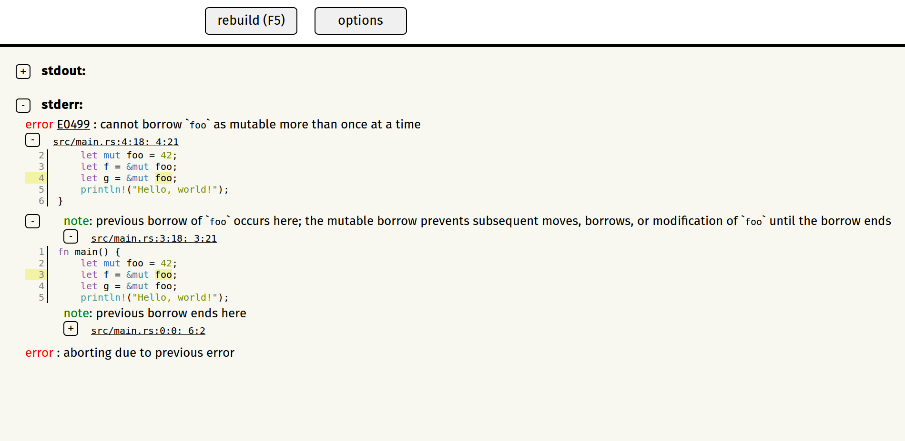
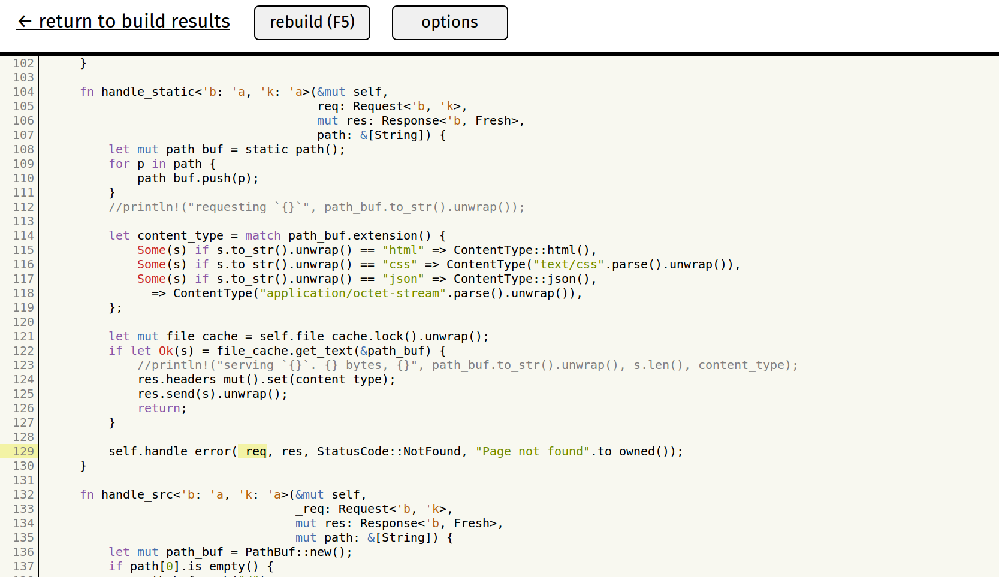

# rustw

A web frontend for the Rust compiler. Displays errors in an easily readable,
concise layout, gives easy access to more information, quickly allows reading or
editing code.

Be warned: very work in progress!

Contents:
* [Building](#building)
* [Running](#running)
* [Customisation](#customisation)
* [Tour](#tour)
* [Contributing](#contributing)

You can play with a [live demo](http://www.ncameron.org/rustw). Be warned that
it is very, very slow since it is running on a crappy server and rustw is not
designed to be run over the internet. When run locally, it is *much* snappier.

Motivation:

* Better errors - we should have interactive experiences for exploring and
  visualising errors involving the borrow checker, macros, etc. Also, easy
  access to error explanations and docs.
* Explore code - provide a platform for searching and understanding source code.
* Convenience - one click (or keystroke) to rebuild, easy to edit and explore
  code, GUI for multirust (in some ways this is a minimal IDE experience,
  focused on building, rather than editing).

## Building

You must perform the first step, the second is optional. They must be
performed in order. Requires a nightly version of Rust to build. If you
are seeing errors building dependencies try nightly-2016-05-12
(4ec5ce5e4).

* `cargo build --release` to build the Rust parts.

* `./build_templates.sh` to rebuild the handlebars templates. The compiled targets
  are part of the repo, so you shouldn't need to do this unless you edit the
  templates. You will need handlebars installed to do this.

## Running

`rustw` in your project's directory (i.e., the directory you would normally use
cargo or rustc from).

Running `rustw` will start a web server and display a URL in the console. To
terminate the server, use `ctrl + c`. If you point your browser at the provided
URL, it will build your project, output will be displayed in your browser. The
terminal is only used to display some logging, it can be ignored. See
[tour](#tour) for more.

Currently, rustw has only been tested on Firefox on Linux ([issue 48](https://github.com/nrc/rustw/issues/48)).

## Customisation

Create a `rustw.toml` file in your project's directory. See [src/config.rs](src/config.rs)
or run `rustw -h` for the options available and their defaults.

## Tour

On loading rustw in your browser it builds the project. When the build is
complete you'll see the output from stdout (messages, hidden by default) and
stderr (errors, warnings, etc., shown by default). If you project compiles
without errors or warnings this won't be very interesting!

To rebuild, reload the page (quickest way is to hit F5) or click the `rebuild`
button.

You'll see a summary of errors and warnings. You can hide the details (notes,
etc.) by clicking the `-` buttons. You can show code snippets by clicking the
`+` buttons next to filenames. This will show syntax highlighted code with the
source of the error (or note, etc.) highlighted. If you click on the filename
itself, it will take you to a source code view of that file. You can right click
these links to bring up a menu, here you have options to edit the file (which
opens the file in an editor which must be specified in `rustw.toml`) or make a
'quick edit', which pops up a text box to edit the code in the browser.

You can click error codes to see explanations.

## Contributing

Rustw is open source (dual-licensed under the Apache 2.0 and MIT licenses) and
contributions are welcome! You can help by testing and
[reporting issues](https://github.com/nrc/rustw/issues/new). Code, tests, and
documentation are very welcome, you can browse [all issues](https://github.com/nrc/rustw/issues)
or [easy issues](https://github.com/nrc/rustw/issues?q=is%3Aopen+is%3Aissue+label%3Aeasy)
to find something to work on.

If you'd like help or want to talk about rustw, you can find me on the
rust-tools irc channel (nrc), email (my irc handle @mozilla.com), or
twitter ([@nick_r_cameron](https://twitter.com/nick_r_cameron)).

The rustw server is written in Rust and uses Hyper. It runs rustc (or Cargo) as
a separate process and only really deals with output on stdout/stderr. We make
heavy use of JSON for communicating between rustc and rustw and between the
server and client. For JSON serialisation/deserialisation we use Serde.rs.

The rustw frontend is a single page web app written in HTML and Javascript. It
uses Handlebars for templating, and JQuery, it doesn't use any other framework.
